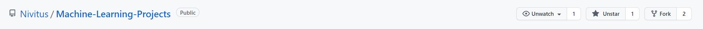
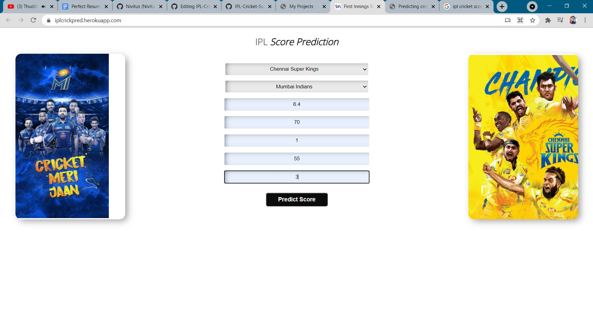
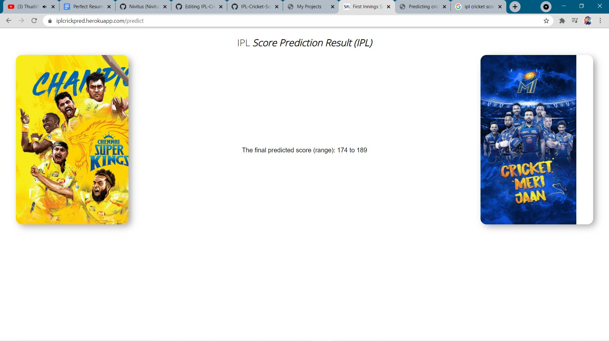
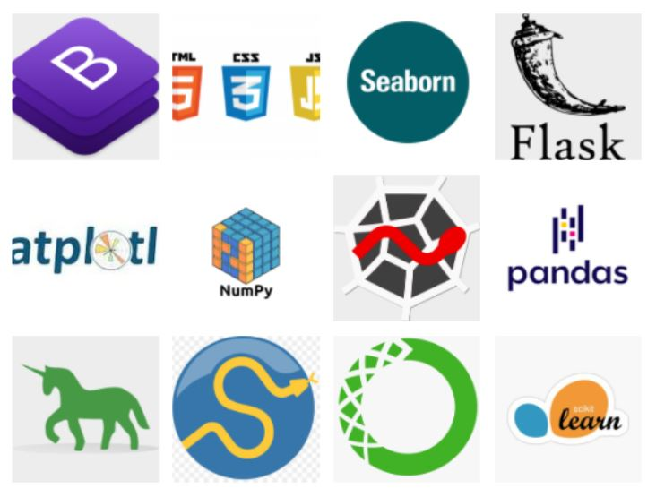

# IPL Cricket Score Prediction

   

## Table of Content ##
- [Demo](#demo)
- [Overview](#overview)
- [Motivation](#motivation)
- [Technical Aspects](#technical-aspects)
- [Installation](#installation)
- [Run](#run)
- [About Dataset](#about-dataset)
- [Deployment on Heroku](#deployment-on-heroku)
- [To Do](#to-do)
- [Bug / Feature Request](#bug-feature-request)
- [Technologies Used](#technologies-used)
- [Team](#team)
- [License](#license)
- [Credits](#credits)

## Demo

  

## Overview

In this project we gonna predict which IPL Cricket team gonna win based on some features. 

- Number of wickets left
- Number of balls left
- On how much scores are the current batsman batting?
- How much the team had scored in last 5 overs?
- How much the team had lost wickets in last 5 overs?

I will use some of these factors to predict score using machine learning algorithms. We use regression analysis in machine learning to predict the final score of an ODI or T-20 match

# Motivation

"A leader is the one who makes an impact and provides inspiration." - M.S Dhoni(Former Indian Cricket team Captain.) M.S. Dhoni exemplified these qualities. I really love to playing cricket and football, so always be a sports lover so that I have an idea about applying Machine Learning techniques on various sports and soprts analytics. This thought gave me to get the motivation for doing this project.


## Technical Aspects
Since we can deploy atmost 5 app in Heroku as a free service, I came up with a new idea of deploying all my projects in a single web app and controlling the each projects navigation with Flask and Python.

Some extra-ordinary features that I have included in my app :
- Visualizing Probability of classifcation in each classification type problems.
- Added all the details about the projects such as data source, code source, libraries and frameworks used in each project's description.
- All my end to end projects in a single view.
- I have to convert into Mobile Application for easy use for formers.

## Installation
To run my app on your local machine, do the following steps.
> **Step 1** : 
   - I have written the Code with Python 3.7.7. If you don't have Python installed you can find it [here](https://www.python.org/downloads/release/python-377/).
   - If you are using a lower version of Python you can upgrade using the pip package, kindly ensure that you have the latest version of pip.
> **Step 2** :
   - If you want the current version of my repository to be in your github, you can do forking my repository by clicking as shown in the picture below.
   
   [](https://github.com/Nivitus/Machine-Learning-Projects)

   
   - Clone my repository to your local machine by running the following command. Before doing this, you have to install git on your machine and make sure you are having proper internet connection.
      - For **Windows OS** user, open *git bash* and run the following command.
      ```bash
      git clone https://github.com/Nivitus/Machine-Learning-Projects.git
      ```
      
      - For **Linus OS** user, open *Terminal* and run the following command.
      ```bash
      git clone https://github.com/Nivitus/Machine-Learning-Projects.git
      ```
   
   - If you don't want to mess up with all these things, you can just download the *zip* file of my GitHub repository by clicking [here](https://github.com/Nivitus/Machine-Learning-Projects/archive/master.zip) and extract it to any file location as your wish and then use it.
   - Now we have done with the downloading of my whole project.

> **Step 3** :
   - After downloading the whole repo, get into the main folder by hit the following command in git bash for Windows OS users and Terminal for Linux OS users.
   ```bash
   cd Deep-Learning-Projects
   ```

> **Step 4** :
   - Now we are going to install all the dependency libraries for this project. Before that you must have Python 3.7.7 and latest version of pip.
   - To install all the dependency libraries in a single command, run the following command.
   
   ```bash
   pip install -r requirements.txt
   ```
   
> **Step 5** :
   - After installing all the dependency libraries, you are ready to run my app on your local machine.
   - To launch my app on your local machine, hit the following command.
   ```bash
   python ml_projects.py
   ```

## Run
- Now you have successfully launched my app on your local machine.
- To view my app, hit the following URL in any of the browser such as Chrome, FireFox, etc..,
   
   ```bash
   http://127.0.0.1:5000/
   ```

## About Dataset
For this project I have download dataset form [Kaggel]((https://www.kaggle.com/ronitf/heart-disease-uci). In this dataset there are three folders like train , test and validation folder . 
## Deployment on Heroku
- After successfully running my app on your local machine, you can also deploy my app on heroku by following the steps given on [Heroku Documentation](https://devcenter.heroku.com/articles/getting-started-with-python). You have to do it on your own risk.
- In case, if you have any issues on deploying the app, please open a new issue by clicking [here](https://github.com/Nivitus/Machine-Learning-Projects/issues/new/choose). Because it may help others while deploying.
- Here is the Deployment link [click here](https://iplcrickpred.herokuapp.com/)

  
  

## To Do

These features will be added in the future :
1. Using Exception handling for handling invalid input.
2. Adding a link to the data source in the project description popup modal.
3. Adding GitHub link to each projects in both description popup modal and project page.
4. Adding better visualization charts for classification type problems.
5. Adding visualization for regrerssion type problems.

## Bug / Feature Request

If you find a bug (the website couldn't handle the query and / or gave undesired results), kindly open an issue [here](https://github.com/Nivitus/Machine-Learning-Projects/issues/new) by including your search query and the expected result.

If you'd like to request a new function, feel free to do so by opening an issue [here](https://github.com/Nivitus/Machine-Learning-Projects/issues/new/choose). Please include sample queries and their corresponding results.

## Technologies Used

  


## Team
[](https://nivitus.herokuapp.com/) |
-|
[NIVITUS](https://nivitus.herokuapp.com) |)


## License
   Copyright 2020 Nivitus

   Licensed under the Apache License, Version 2.0 (the "License");
   you may not use this file except in compliance with the License. 
   You may obtain a copy of the License at

       http://www.apache.org/licenses/LICENSE-2.0

   Unless required by applicable law or agreed to in writing, software
   distributed under the License is distributed on an "AS IS" BASIS,
   WITHOUT WARRANTIES OR CONDITIONS OF ANY KIND, either express or implied.
   See the License for the specific language governing permissions and
   limitations under the License.

## Credits
1. Kaggle - I have collected dataset from kaggle for some of the projects such as Loan Status Prediction, Iris Species Classification, Boston House Price Prediction, etc..,
2. Krish Naik -  I have Learned many of the concepts & ideas from his Youtube Channel.


 

